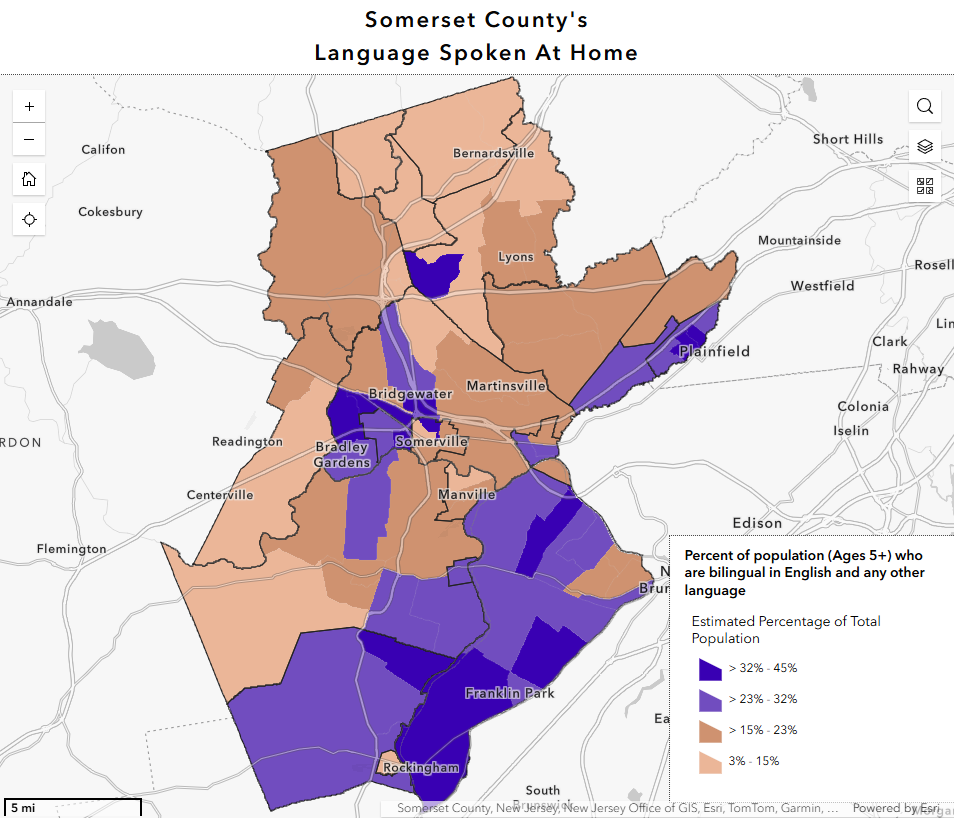
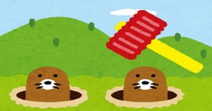

```{r}
#| label: setup
#| include: false
options(htmltools.dir.version = FALSE)
knitr::opts_chunk$set(
  echo = TRUE, 
  fig.asp = 0.5625,
  out.width = "100%", 
  fig.retina = 2, 
  dpi = 300
  )

set.seed(20251108)

library("tidyverse")
library("here")
library("knitr")

theme_psllt <- function(...) {
  list(
    theme_bw(base_family = "Palatino", ...), 
    theme(
      plot.subtitle = element_text(color = "grey40"), 
      panel.grid.major = element_line(color = 'grey90', linewidth = 0.15),
      panel.grid.minor = element_line(color = 'grey90', linewidth = 0.15)
    )
  )
}

theme_set(theme_grey(base_size = 30))

```

# A bit about us {.transition}

## Our Organization

Who are we? CENTER THIS

- We are RU Bilingual
- Graduate students in the Spanish & Portuguese department at Rutgers
- We study bilingualism and second language acquisition

## Our Organization

What do we do? CENTER THIS

- We want our day-to-day research to be useful to a broader public
- We want to create a safe place to discuss multilingualism in our communities

## Our Organization

Our objectives: CENTER THIS

- Support and defend bilingualism at home, in school, and in our community
- Allow for academic research to have more practical applications

# What we'll be talking about today {.transition}

- What is bilingualism?

- What myths exist about bilingualism?

- What advantages are there to bilingualism?

- How can we contribute to maintaining bilingualism?

# What is Bilingualism? {.transition}

Do you consider yourself bilingual?

::: notes
Discuss in pairs, then share.
:::

## Bilingualism

- The ability to understand and/or communicate in more than one language
- Is there a minimum requirement to be considered bilingual?

Four components:
- read / write / speak / listen

## Bilingualism versus Biliteracy

- *Biliteracy* refers to having the ability to read and write in two languages
- Someone who is *biliterate* is bilingual and can read/write in their two languages
- A bilingual person is not necessarily biliterate
- Some bilinguals cannot read/write in their two languages

::: notes
Mention that for the vast majority of history, humans did not write. Today, the vast majority of languages remain solely oral.
:::

## Bilingualism in the world

CHANGE THIS SLIDE SO THAT IT'S IMAGES, NOT JUST TEXT

- How many languages are there in the world?

  - More than 6,900!
  
- How many countries are there?
  
  - 206

More than 33 languages per country

The truth:

- More than half of kids around the world grow up in a bilingual environment
- More than half of the world's population is bilingual

::: notes
Many languages are moribund, and we have seen a major extinction event of languages due to colonialism.
:::

## Bilingualism in the US

ADD IMAGES, NOT JUST TEXT
Maybe one slide per level US > NJ > Somerset

- 22% of people in US speak a language other than English
- 34% of the New Jersey population
- 37% of Somerset County, NJ

::: footer
https://www.census.gov/acs/www/about/why-we-ask-each-question/language/
:::

##

{.absolute top="0" left="200" width="650" height="650"}

::: footer
https://experience.arcgis.com/experience/cbd39e908efc459abbc2aa51916aed09/page/Language-Spoken-At-Home
:::

## Langauges in New Jersey

ADD MAP HERE

# What myths exist about bilingualism? {.transition}

## True or false?

1) Being bilingual is like being two monolingual people in one body.

2) You have to have proficient skills in speaking, reading, writing, and listening to be considered bilingual.

3) Your ability to speak your languages do not change over your lifetime.

::: notes
Discuss with a partner
:::

## Being bilingual is like being two monolingual people in one body.

FALSE.

No hay separación de idiomas, los lenguajes están interconectados como si fueran parte de una tela de araña, si un hilo se mueve, hace vibrar toda la tela de araña.

## Being bilingual is like being two monolingual people in one body.

- A bilingual's two languages are always "on" [@paradis1993linguistic]

- This is important when we want to speak and read in one language



::: notes
Nuestros idiomas son como los topitos de Whack a mole, están siempre intentado salir y nosotros tenemos que aplastarlos para que nos dejen hablar el idioma que queremos en el momento que queremos.
:::

## Being bilingual is like being two monolingual people in one body.

- Sometimes we use the wrong word:

  - What I want to say: "Pass me the [fork]{.emph}."
  - What I actually say by accident: "Pass me the [knife]{.emph}."

## Being bilingual is like being two monolingual people in one body.

- A multilingual speaker's languages are always competing for activation
- Activation can depend on...
  - semantics
  - phonetics
  - syntax
  

::: notes  
Give an example of each with Spanish & English
Add images for this: Coche – Car – Casa (Coche activa Car y Car es competidor fonológico de Casa)
:::

# You have to have proficient skills in speaking, reading, writing, and listening to be considered bilingual.

FALSE.

Bilingualism comes in all shapes and sizes.

People who study dead languages like Latin or Greek might only be able to [read]{.emph}.

Many languages do not have written forms.

Many people who grow up in the US are exposed to a language other than English at home, and there are many outcomes:

- can only comprehend spoken language
- can speak and comprehend, but cannot read or write
- can read, write, speak, and comprehend spoken language

## Your ability to speak your languages do not change over your lifetime.

Language attrition.

Switch dominance.

# What do we think about bilingualism? {.transition}

## True or false?

Bilingual children can't achieve/gain the same knowledge that monolingual children can.

FALSE
- Monolingual children are evaluated in phases
- Bilingual children too!
- Problem: the same scale exam is normally used to evaluate these two different populations.

THE TRUTH:
add some truths & clean up the FALSE statements

## True or false?

Bilingual children sometimes mix their languages. Are they confused? Is it too hard to speak two languages?

FALSE
- Bilingual children know what language to speak and with who ADD CITATION AND AGE
- Mixing languages isn't a sign of confusion or laziness

THE TRUTH:
- Bilinguals who mix languages actually know with whom to mix and when it's (not) appropriate. ADD CITATION
- There are [rules]{.emph} to mixing languages -- it's not random!
- Mixing both at the same time is a sign of advanced knowledge of the two languages! ADD CITATION
- We call this mixing [codeswitching]{.emph}

::: notes
La comprensión y la producción de un bilingüe es diferente de la producción y la comprensión de un monolingüe porque los idiomas están siempre encendidos.
:::

## Mixing languages

Rate these sentences on how natural they seem to you:

  - Can you peinarme?
  - I am estrenando this t-shirt.
  - El plato está en el sink.
  ADD UNNATURAL CODESWITCHES

## Codeswitching and Spanglish

"Es una combinación de fenómenos de contacto distintos. Estos fenómenos incluyen préstamos, calcos, extensiones semánticas, préstamos temporales, mezclas, entre otros" [@casielles2017spanglish]

- troca ~ truck
- llamar pa'trás ~ to call back

"Spanglish is what we speak, who we Latinos are, and how we act and how we perceive the world" [@morales2007living]

## Codeswitching

- Estás ready?
- Vamos a janguear.
- Vamos para el mall.

"Si quieres empezar otra pelea, I'm not in the mood. Anyway, vine a otra cosa" [@prida1991beautiful]

Do you have other examples?

## Spanglish in the Wild

add images here of spanglish

# Are There Advantages to Being Bilingual? {.transition}

Yhosep's part will go here I guess?

Add Stroop Test here.

Multilingualism & brain health (check study from Nuria's class)

Multilingualism & Alzheimer's (check study from Nuria's class)

# How Can we Contribute to Maintaining Bilingualism? {.transition}

## What can you do to maintain your language(s)?

ADD IMAGES OF FAMILY ACTIVITIES AND STUFF

## What can you do to maintain your language(s)?

The language(s) should be spoken whenever possible
  - talk about daily activities
  - tell stories and histories
  - ask questions
  - [motivate everyone to participate]{.emph}
  
USE YOUR LANGAUGE!

## What can you do to maintain your language(s)?

Create a [network]{.emph} of speakers

- Look for community activities and people outside your home
- Don't be afraid of using different languages at home
- Interact with others in your target language

## What can you do to maintain your language(s)?

- Tell or read stories in the target language
- Listening is important too!
- Promote reading and writing skills by teaching or actively modeling these skills

## What can you do to maintain your language(s)?

- Create safe place for people to communicate in their languages

Zimmerli picture

# DISORDERED SPEECH

https://www.youtube.com/watch?v=DJVz0rNJ0BA&list=PLnfCMjNTvILC8q1cknIk_fvzOfOV_oZhB&index=191

Use this to talk about bilingual language development and disorders

Check out Patrick's work for overdiagnosis of disordered speech in bilingual children.

## Thanks! {.final visibility="uncounted"}

::: {.absolute top="20" left="0"}
<div style="text-align:center;">


<p style="margin-top:8px; font-size:14px;">
\@ru_bilingual
</p>
</div>
:::

{.absolute top="0" right="0" width="200" height="200"}

::: {.absolute top="300" left="0"}
<div style="text-align:center;">


<p style="margin-top:8px; font-size:14px;">
Slides
</p>
</div>
:::
</br>


<br>

<table style="border-collapse: collapse; border: none;">

  <tr>
    <td style="text-align: right; padding-right: 10px;">
      <a href="https://www.instagram.com/ru_bilingual/"></a>
    </td>
    <td>\@ru_bilingual</td>
  </tr>

  <tr>
    <td style="text-align: right; padding-right: 10px;">
      <a href="mailto:rme70\@scarletmail.rutgers.edu"></a>
    </td>
    <td>rme70\@scarletmail.rutgers.edu</td>
  </tr>

  <tr>
    <td style="text-align: right; padding-right: 10px;">
      <a href="https://robertespo.github.io/"></a>
    </td>
    <td>robertespo.github.io</td>
  </tr>

  <tr>
    <td style="text-align: right; padding-right: 10px;">
      <a href="https://github.com/RobertEspo"></a>
    </td>
    <td>\@RobertEspo</td>
  </tr>
  
  <tr>
    <td style="text-align: right; padding-right: 10px;">
      <a href="mailto:yb317\@scarletmail.rutgers.edu"></a>
    </td>
    <td>yb317\@scarletmail.rutgers.edu</td>
  </tr>
  
  <tr>
    <td style="text-align: right; padding-right: 10px;">
      <a href="https://www.jvcasillas.com/quarto-rutgers-theme/"></a>
    </td>
    <td>jvcasillas.com/quarto-rutgers-theme</td>
  </tr>
  

</table>

## References {visibility="uncounted"}

::: {#refs .smaller}
:::